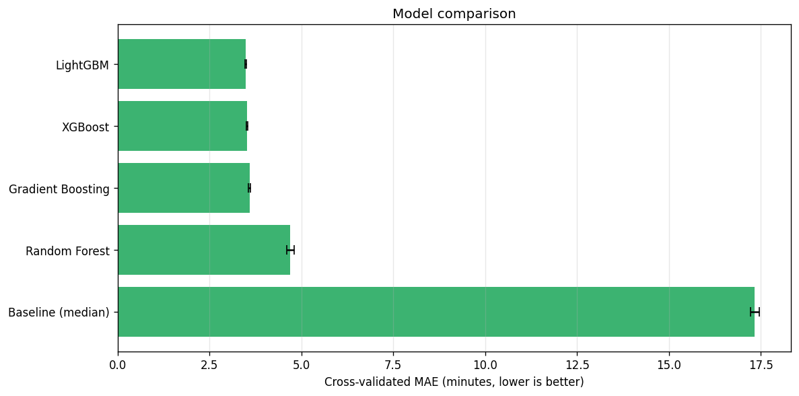
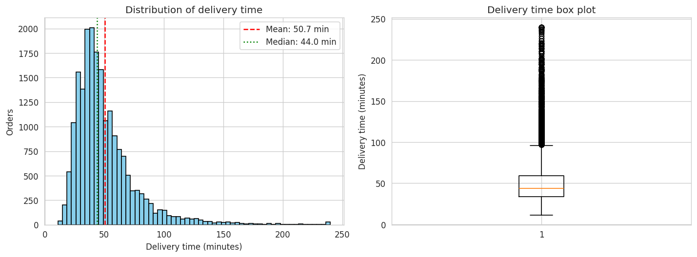
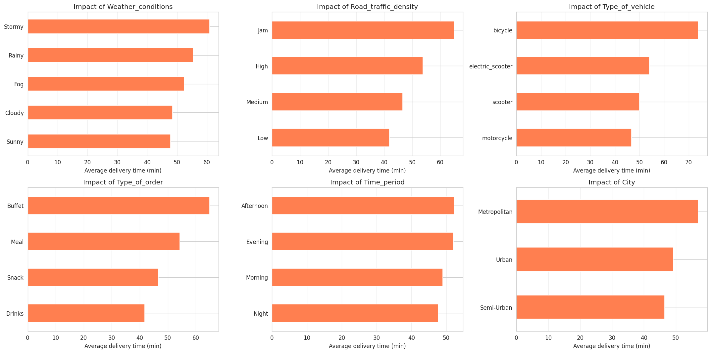
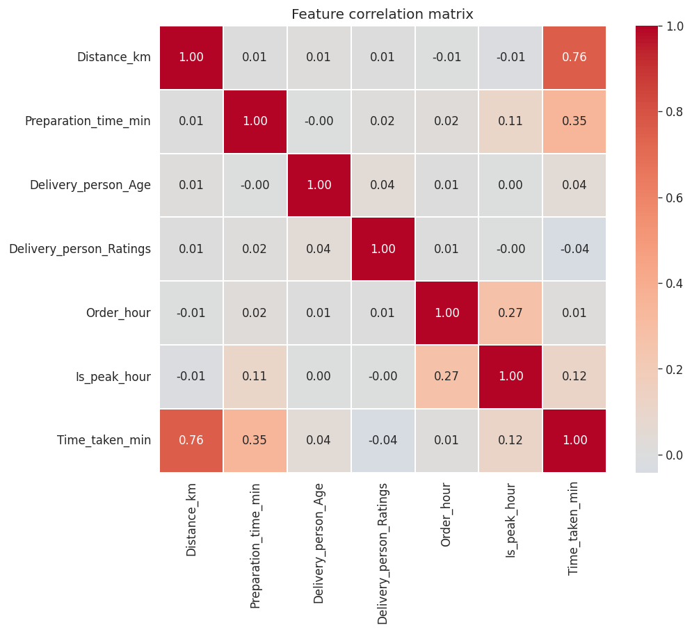
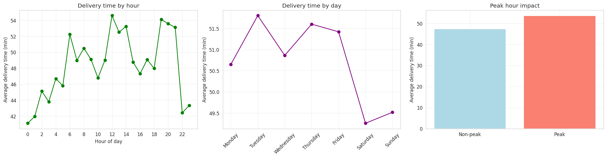
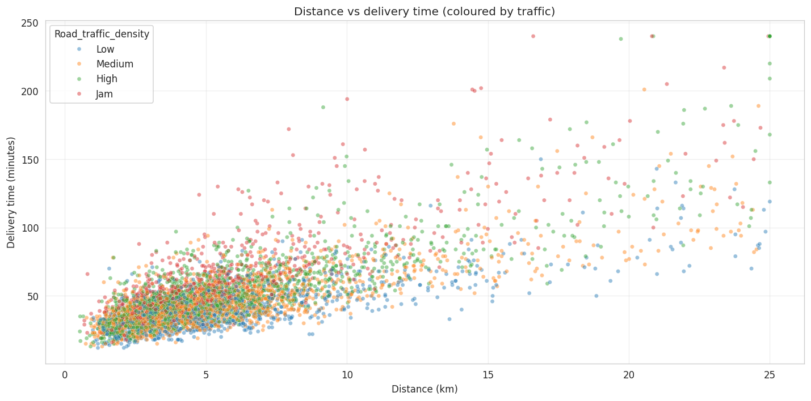
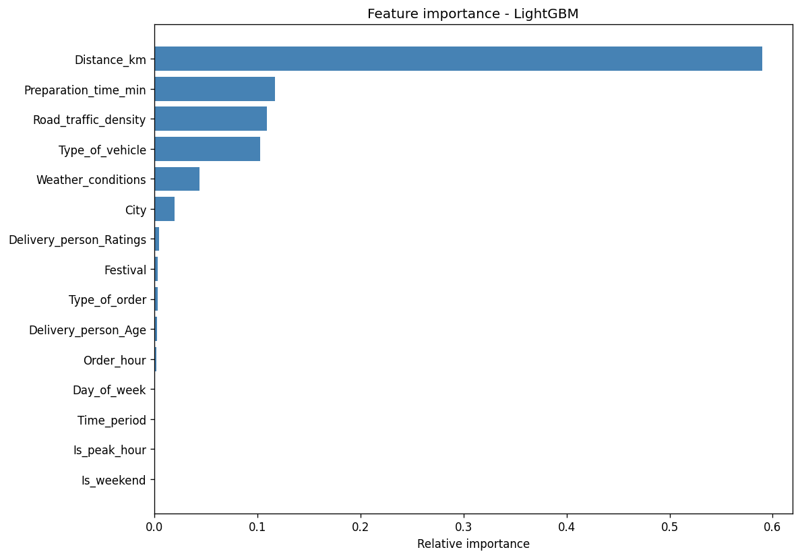
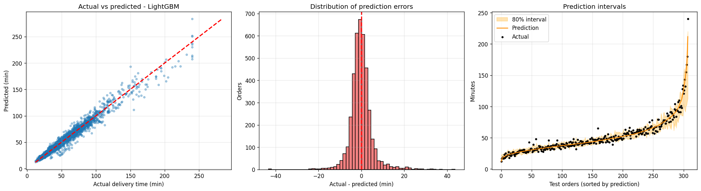

# Food Delivery Time Prediction

A machine learning web app that estimates how long a food order will take to
arrive, from kitchen to doorstep, with a calibrated 80% range. It compares four
gradient-boosting / tree-ensemble models, serves the best one through a Flask
UI and JSON API, and ships as a small Docker image.



## Highlights

- **Accurate on held-out data**: LightGBM reaches a test MAE of **3.4 min**,
  R² **0.965**, with **81%** of predictions within ±5 minutes.
- **Honest uncertainty**: every estimate comes with an 80% range from quantile
  models that are conformally calibrated. On the test set **80.7%** of real
  delivery times fall inside it.
- **Every input matters**: the data simulates delivery time as preparation +
  pickup + travel + drop-off, so preparation time, traffic, weather, vehicle and
  city all move the estimate the way you would expect.
- **No train/serve skew**: training and the API share one feature-engineering
  module, and the encoder and model are saved together as a single pipeline.
- **Production-ready serving**: input validation with per-field errors, a
  physical-feasibility guardrail, JSON errors, health checks, gunicorn and a
  non-root Docker image.
- **Tested**: 97 tests plus a CI workflow that also builds and smoke-tests the
  Docker image.

## Results

Models are compared with 5-fold cross-validation on the training split (16,000
orders); the winner is then scored once on 4,000 held-out orders.

| Model | CV MAE (min) | Test MAE (min) | Test RMSE | Test R² | Within ±5 min |
|---|---|---|---|---|---|
| **LightGBM** (selected) | **3.49 ± 0.02** | **3.40** | **5.18** | **0.965** | **81.0%** |
| XGBoost | 3.52 ± 0.02 | 3.42 | 5.23 | 0.964 | 81.1% |
| Gradient Boosting | 3.59 ± 0.03 | 3.50 | 5.34 | 0.963 | 80.0% |
| Random Forest | 4.70 ± 0.10 | 4.62 | 7.46 | 0.927 | 71.0% |
| Baseline (always predict the median) | 17.34 ± 0.12 | 17.78 | 28.57 | -0.066 | 24.8% |

The most important features are distance (59% of total gain), preparation time
(12%), traffic (11%), vehicle (10%) and weather (4%).

> The dataset is synthetic (see `1_generate_data.py`), so these numbers describe
> how well the model recovers the simulated process, not real-world accuracy.

## Quick start

A trained model is committed in `models/`, so you can run the app straight away.
Python 3.10–3.12 is supported.

```bash
python -m venv .venv
source .venv/bin/activate          # Windows: .venv\Scripts\activate
pip install -r requirements-dev.txt

python app.py                      # http://127.0.0.1:5000
```

To rebuild everything from scratch (about a minute):

```bash
make pipeline      # or: python 1_generate_data.py && python 2_eda_analysis.py && python 3_train_model.py
make test          # or: python -m pytest
```

| Step | Script | Output |
|---|---|---|
| 1. Generate data | `1_generate_data.py` | `data/food_delivery_data.csv` (20,000 orders) and a 1,000-row sample |
| 2. EDA and features | `2_eda_analysis.py` | `data/food_delivery_processed.csv` and plots 01–05 in `visualizations/` |
| 3. Train and compare | `3_train_model.py` | `models/delivery_model.joblib`, `models/model_comparison.csv` and plots 06–08 |

Every script accepts `--help` for paths and options (for example
`1_generate_data.py --samples 50000`).

## How it works

**Data.** Riders (fixed age, rating, vehicle and a hidden skill level) and
restaurants (fixed location, city type and kitchen speed) are simulated around
Bengaluru. For every order:

```
Time_taken_min = preparation                       (order type, kitchen speed, rush hour, festival)
               + pickup handover
               + distance / vehicle speed × traffic × weather × city × festival × night × rider skill
               + drop-off handover                 (longer for high-rises and buffet orders)
               + noise, and occasional incidents
```

Pickup timestamps are exactly the order time plus preparation time (including
orders that cross midnight), so the preparation time the model learns from
matches what a user types into the form.

**Features** (`delivery/features.py`): distance, preparation time, rider age and
rating, order hour, day of week, weekend and peak-hour flags, time of day,
weather, traffic, vehicle, order type, festival and city type.

**Model selection** (`3_train_model.py`): each candidate is a scikit-learn
`Pipeline` (ordinal encoding + regressor) scored with K-fold cross-validation
on the training split only. The test split is touched once, for the final report.

**Prediction intervals**: two quantile models (10th and 90th percentile) are fit
on part of the training data. Split-conformal calibration (CQR) on the rest
widens them just enough to reach the target coverage. Uncalibrated, they only
covered 72.9% of test orders.

**Guardrail**: no estimate can beat the vehicle's top urban speed
(`preparation + distance / top speed + 2 min`). On the test set the model never
needed it (0% of orders), but it protects against nonsense at the edges.

## API

### `POST /predict`

Only `distance_km` is required. Other fields fall back to the defaults below;
`order_hour` and `day_of_week` default to the server's clock. Category names are
case-insensitive (`"electric scooter"` works).

| Field | Type | Range / values | Default |
|---|---|---|---|
| `distance_km` | number | 0.1 – 25 | required |
| `preparation_time` | number (min) | 1 – 60 | 15 |
| `delivery_person_age` | integer | 18 – 60 | 30 |
| `delivery_person_ratings` | number | 1.0 – 5.0 | 4.5 |
| `order_hour` | integer | 0 – 23 | current hour |
| `day_of_week` | integer | 0 (Mon) – 6 (Sun) | today |
| `weather` | string | Sunny, Cloudy, Rainy, Fog, Stormy | Sunny |
| `traffic` | string | Low, Medium, High, Jam | Medium |
| `vehicle` | string | motorcycle, scooter, electric_scooter, bicycle | motorcycle |
| `order_type` | string | Snack, Meal, Drinks, Buffet | Meal |
| `festival` | string or bool | No, Yes | No |
| `city` | string | Urban, Semi-Urban, Metropolitan | Urban |

```bash
curl -X POST http://127.0.0.1:5000/predict \
  -H "Content-Type: application/json" \
  -d '{"distance_km": 5.5, "preparation_time": 20, "weather": "Rainy", "traffic": "High",
       "vehicle": "motorcycle", "order_type": "Meal", "city": "Urban", "festival": "No",
       "delivery_person_age": 30, "delivery_person_ratings": 4.6, "order_hour": 20, "day_of_week": 4}'
```

```json
{
  "success": true,
  "predicted_time": 53,
  "predicted_time_min": 48,
  "predicted_time_max": 60,
  "interval_confidence": 0.8,
  "breakdown": {"preparation_min": 20.0, "travel_and_handover_min": 33.0},
  "message": "Estimated delivery time: 53 minutes",
  "model": "LightGBM",
  "inputs": {"distance_km": 5.5, "preparation_time": 20.0, "...": "normalised inputs, defaults filled in"}
}
```

Invalid input returns `400` with an error for every offending field:

```json
{
  "success": false,
  "error": "Invalid input.",
  "errors": {
    "distance_km": "must be between 0.1 and 25",
    "weather": "must be one of: Sunny, Cloudy, Rainy, Fog, Stormy"
  }
}
```

### `GET /api/model-info`

Model name, training date, test metrics, cross-validation scores, interval
calibration, feature importances and the full model comparison.

### `GET /health`

`200 {"status": "healthy", "model_loaded": true, ...}`, or `503` if the model
could not be loaded. `/predict` also returns `503` in that case rather than
serving made-up numbers.

## Deployment

### Docker

```bash
docker build -t fooddelivery .
docker run -p 5000:5000 fooddelivery
# or
docker compose up -d --build
```

The image contains only the runtime code and the model bundle, runs as a
non-root user, and has a built-in health check.

### Render, Railway, Heroku and similar

Deploy the repository with its `Dockerfile`. The app listens on `$PORT`, which
these platforms set automatically. Without Docker, use
`pip install -r requirements.txt` as the build command and `gunicorn app:app`
as the start command.

### Configuration

| Variable | Default | Purpose |
|---|---|---|
| `PORT` | `5000` | Port to listen on |
| `WEB_CONCURRENCY` | `2` | Gunicorn worker processes |
| `GUNICORN_TIMEOUT` | `60` | Worker timeout in seconds |
| `MODEL_PATH` | `models/delivery_model.joblib` | Model bundle to serve |
| `LOG_LEVEL` | `INFO` | Logging verbosity |

`gunicorn.conf.py` preloads the model once and shares it across workers,
roughly 100 MB less RAM than loading it per worker. That is only safe because
`app.py` pins `OMP_NUM_THREADS=1`: OpenMP thread pools don't survive `fork()`,
and without the pin workers deadlock on their first prediction.

> **Library versions are pinned** in `requirements.txt` because the model
> bundle must be loaded with the versions it was trained with. The app logs a
> warning on a mismatch. After upgrading a library, run `3_train_model.py`.

## Project structure

```
├── 1_generate_data.py        # Step 1: synthetic dataset
├── 2_eda_analysis.py         # Step 2: EDA, feature engineering, plots
├── 3_train_model.py          # Step 3: CV model selection, intervals, model bundle
├── app.py                    # Flask app and JSON API
├── gunicorn.conf.py          # Production server settings
├── delivery/                 # Shared code used by all of the above
│   ├── config.py             #   categories, input ranges, paths, constants
│   ├── features.py           #   feature engineering (training and serving)
│   ├── validation.py         #   request validation and normalisation
│   └── predictor.py          #   model loading, guardrail, intervals
├── templates/index.html      # Web UI
├── data/                     # Generated datasets
├── models/                   # delivery_model.joblib, model_comparison.csv
├── visualizations/           # EDA and evaluation plots
├── tests/                    # pytest suite
├── Dockerfile, docker-compose.yml, .dockerignore
├── requirements.txt          # Runtime dependencies (pinned)
├── requirements-dev.txt      # + training, plotting and test tools
├── Makefile
└── .github/workflows/ci.yml  # Tests on Python 3.10–3.12 + Docker smoke test
```

## Visualizations

| | |
|---|---|
|  |  |
|  |  |
|  |  |



## Troubleshooting

- **"Model is not loaded" / `/health` returns 503**: `models/delivery_model.joblib`
  is missing or unreadable. Run `python 3_train_model.py`.
- **"Model was trained with scikit-learn X but Y is installed"**: install the
  pinned versions (`pip install -r requirements.txt`) or retrain.
- **Port already in use**: `PORT=5001 python app.py`.

## License

MIT License. Free to use for personal and commercial projects.
